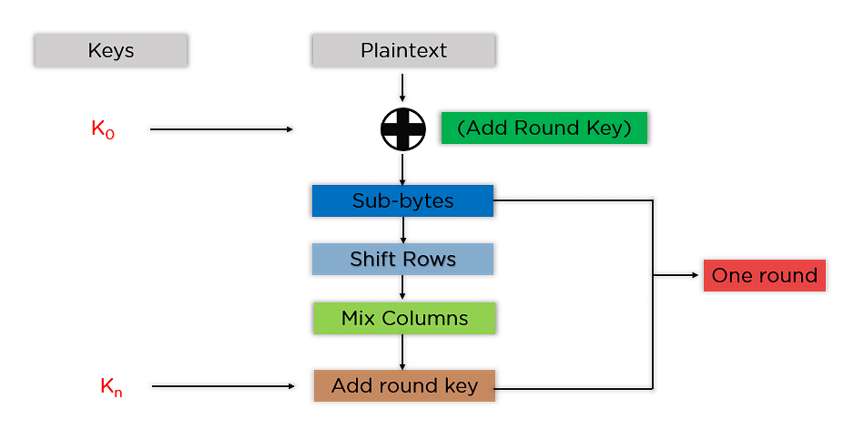
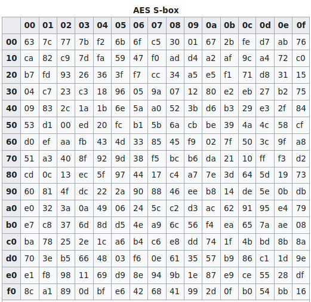
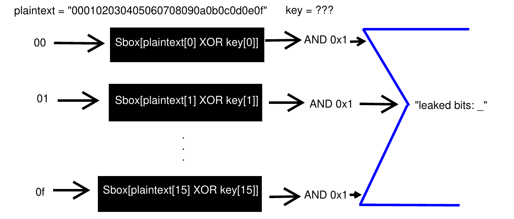
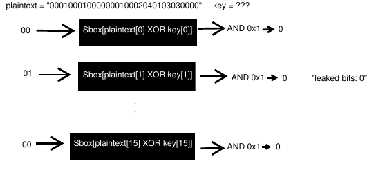
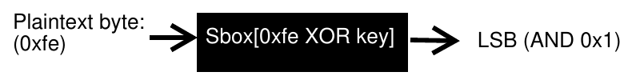
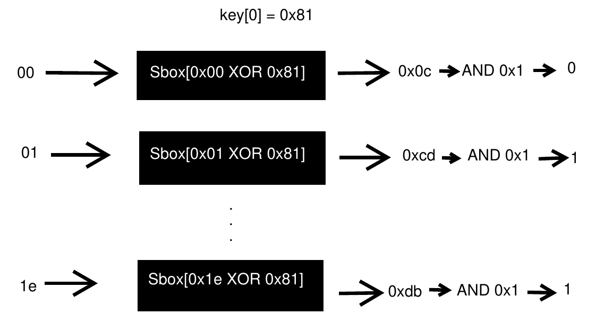

# PowerAnalysisWarm
<details>
<summary>Description</summary>
<br>
This encryption algorithm leaks a "bit" of data every time it does a computation. Use this to figure out the encryption key.

Additional details will be available after launching your challenge instance.
</details>

## Precursor
### What is AES?
Advanced Encryption Standard (AES) is a symmetric-key block cipher used in VPNs, drive encryption, and government information protection. It is the most used encryption cipher used to date, and the versatility of its base leads to different varieties according to specific needs.
### Why AES?
Because of its properties, this algorithm easily and quickly allows data to be encrypted and decrypted at will when a key is known. AES is a worldwide algorithm that works great, when it is not improperly configured. Several attacks are known for insecure AES, including side channel attacks (which we will be discussing later on).
### How AES?
Let's say Alice wants to securely send a simple 16 byte message to Bob using AES.

Alice decides to create a 16 byte key that will encrypt the message she sends to Bob. She settles on the following:

Key: "My precious key!"

Plaintext: "Are belong to us"


#### XOR
Alice first converts the key and the plaintext to hex:

Key: 4d792070726563696f7573206b657921

Plaintext: 4172652062656c6f6e6720746f207573

\
She then begins by XORing the plaintext and the key.

Ex. First byte: 0x4d XOR 0x41 = 0x0c

Second byte: 0x79 XOR 0x72 = 0x0b
  \
  \
Key XOR Plaintext = 0c0b455010000f060112535404450c52
#### Sub-bytes
Next, Alice takes each byte in the XORed result and matches it with a substitution box (S-box). Because the first byte of the XORed value is 0x0c, Alice indexes the 13th value in the S-box and substitutes it for 0x0c.

Luckily, the AES S-box is a standard lookup table originating from the [Rijndael S-box](https://en.wikipedia.org/wiki/Rijndael_S-box).



The left column indexes with first half byte and the top row indexes using the last half byte of the input.

Ex. "0c" would be substituted for "fe".

Sub-bytes = fe2b6e53ca63766f7cc9ed20f26efe00

Although there are subsequent steps involved during the encryption process, this challenge focuses specifically on the XOR and S-box lookup in AES.

### Where AES?

The function "leaky_aes_secret" in `encrypt.py` demonstrates where AES is used:
```
def leaky_aes_secret(data_byte, key_byte):
    out = Sbox[data_byte ^ key_byte]
    leak_buf.append(out & 0x01)
    return out
```

The second line appears to be the combination of both AES steps previously defined. Additionally, the line after will leak the last bit of every substituted byte and later find the sum of the bits.

Per our example, the least significant bits of Sub-bytes would be: 0101010101100000

The sum (6) would subsequently be leaked with the line: `leakage result: 6`

The challenge essentially asks one question: When we are given the sum of least significant bits after providing a plaintext, is it possible to find the encryption key?

## Theory
We are dealing with a [side channel attack](https://en.wikipedia.org/wiki/Side-channel_attack). The least significant bit of each byte is calculated and the total is leaked to the user.



<details>
<summary>Example</summary>
<br>
Let's assume the AES encryption algorithm outputs the ciphertext: "f1e03f01bba75256cd5c0d84be1bb2f2"

The least significant bit of each byte is as follows:
|Byte|LSB| |Byte|LSB
|----|----|---|----|---|
|f1|1||cd|1
|e0|0||5c|0
|3f|1||0d|1
|01|1||84|0
|bb|1||be|0
|a7|1||1b|1
|52|0||b2|0
|56|0||f2|0

Therefore, the output would be the sum of the LSBs: `leakage result: 7`
</details>

How do we find the key from the result?

## Isolating the LSBs
We must first control the leak to find the key. To do this, we must be able to correspond individual bytes to bit leakage. By providing a payload that returns 0 bits of leakage, we can move on to the next step of manipulating individual bytes.
```python
def testbyte(bits, zero_payload): #tests payload bytes to decrease bit leakage
    for i in range(0xff): #returns before completion
        prepend = ''.join([x for x in zero_payload]) #increases each byte
        payload = "{:02x}".format(i) + "00"*(16 - len(zero_payload) - 1)
        print(prepend + payload)
        result = int(sendinput(prepend + payload)) #receives the bit leakage
        print("Bits: {}".format(result))
        if result < bits:
            return payload[0:2] #return incremented byte
        elif results > bits: #LSB was already 0
            return "00"

zero_payload = [] #becomes a list of payload bytes that output 0 leakage bits

for i in range(0x10): #for each byte
    result = testbyte(bits, zero_payload) #lowers bit leakage if it can
    zero_payload.append(result) #appends the returned byte
    print(zero_payload)
    if result != "00":
        bits -= 1 #for each byte that once had LSB
```
Because I am using payload "00000000000000000000000000000000", I receive `leakage result: 8`.
For the first byte of the payload, increment value until it returns a bit leakage value lower than 8. If the bit count becomes higher, the byte "00" already returns LSB 0.
Repeat for each byte while prepending the bytes from the previous result to craft a "zero payload".
Thus, when we submit the "zero payload", the bit leakage will always be 0.



## Solving
Now, we solve!

Choose one payload byte to increment. Record the bit leakage and the incremented payload byte. Repeat for a certain amount of times (more details later).

```python
zero_payload = ['00', '01', '00', '01', '00', '00', '00', '01', '00', '02', '04', '01', '03', '03', '00', '00']
payload = zero_payload.copy()
data_byte = []
leak = []
position = 0 #first byte will be incremented
size = 30 #amount of increments/recordings

for i in range(size):
    payload[position] = "{:02x}".format(int(zero_payload[position], 16) + i) #increment
    data_byte.append(int(payload[position], 16)) #record the byte
    result = int(sendinput(''.join(payload))) #get the result (1 or 0)
    leak.append(result) #record result

```

The bit leakage recorded will either be a 1 or a 0 (because the other 15 bytes return an LSB of 0).

What does this mean?

By curating a list of returned LSBs, it is possible to brute force the key byte by byte.



As the payload byte increments, XORing with the static key changes its value, returning different Sbox numbers. Therefore, the list of leaked Sbox LSBs matches the Sbox LSBs of a given key byte XORed with the incremented payload byte.



```python
for key in range(0xff): #tests all possible bytes
    testleak = [0] * size
    for pos in range(size):
        testleak[pos] = Sbox[data_byte[pos] ^ key] & 0x1 #gets LSB of possible Sbox match
    if leak == testleak: #leak list defined previously
        print("MATCH: 0x{:02x}".format(key))
        final = key
        break
```

We have successfully brute forced the first byte of the AES key. Now repeat 15 more times and we've got the encryption key!

For the python solution code, see "power.py".

[](https://asciinema.org/a/SyBN8KQjmwGWnoWazw0GeCZEH?speed=2&autoplay=1)

## Final Thoughts
Overall, this was a fun challenge and a fantastic introduction to side-channel attacks. After several hours of scripting, the key is produced in 90 seconds. I love scripting.

My prior experience with [CryptoPals](https://www.cryptopals.com/) helped me the most with solving this challenge.

<details>
<summary>Author's Note</summary>
<br>
Use the variable `SILENT=1` with `python3 power.py` to witness the beauty of the password oracle.
</details>

